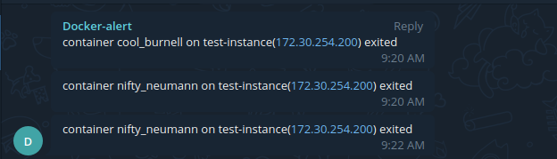

### Pendahuluan
Container, ya sebuah istilah yang sedang populer pada era saat ini. dan saya pun memakainya baik untuk development aplikasi ataupun production. Namun beberapa hari belakangan ini tim saya mengalami kendala yakni sekitar 1-2 hari semua container yang berada di VM production berhenti secara tiba. Setelah diteliti hal ini disebabkan oleh docker daemon yang restart tanpa disuruh (asli bikin kesel). Dan kesalahan dari tim DevOps ialah tidak menambahkan parameter restart: always ketika production, jadilah ketika daemon docker restart dan container tidak me-restart otomatis. Yang lebih gak enak lagi ialah para client yang lebih dulu tau ketimbang tim DevOps. Karena itu pada tulisan kali ini saya akan membagi sedikit tips yang dibantu oleh Kang [Mustapha](https://instagram.com/topahadzi) untuk monitoring container docker dan mengirimkan alert ke Telegram apabila ada container yang mati (exited). 

### Kebutuhan 
- Docker
- Bot Telegram
- Cron

### Tahapan
1. Siapkan bot Telegram untuk mengirimkan pesan alert ke tim. Untuk panduannya bisa dilihat di [link](https://core.telegram.org/bots#create-a-new-bot)
2. Buat skrip alert, 
```
vim script-alert.sh


............
#!/bin/sh
PATH=/usr/local/sbin:/usr/local/bin:/sbin:/bin:/usr/sbin:/usr/bin
export IPVM=$(/sbin/ifconfig ens3 | grep -i mask | awk '{print $2}')
vm=$(hostname)
list_of_containers=$(sudo docker ps -a | awk '{if(NR>1) print $NF}')
containers=`docker ps -f status=running --format "{{.Names}}"`
for i in $list_of_containers
do
  if echo $containers |grep  $i
    then  echo "$i online "
    else curl -X POST -H 'Content-Type: application/json' -d '{"chat_id": "[CHATID]", "text": "'"container $i on $vm($IPVM) exited"'", "disable_notification": true}'  https://api.telegram.org/bot[YOUR_BOT_TOKEN]/sendMessage > /dev/null
  fi 
    
done

exit 0
```
3. Buat cron dan jadwalkan diperiksan tiap satu menit 
```
crontab -e 

*/1 * * * *     /bin/sh /home/ubuntu/script-alert.sh
```
Apabila ada container yang mati maka Bot akan mengirimkan alert seperti beritku 


Voila, docker alert berhasil dibuat. 

Sekian, semoga membantu


