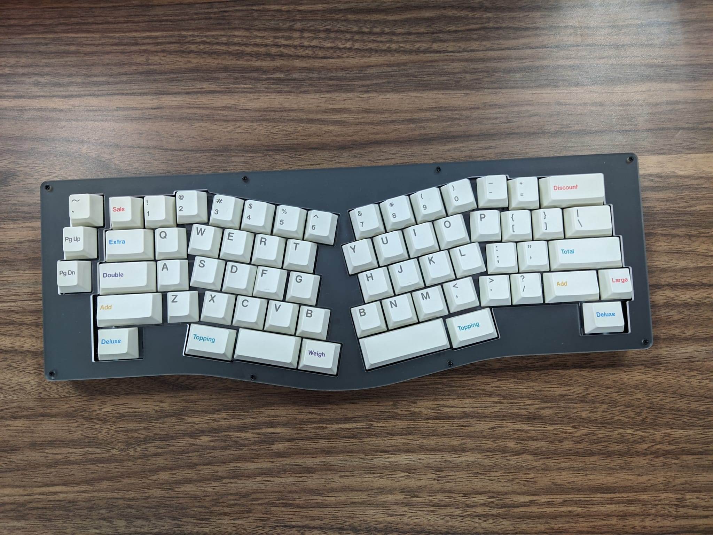

# Day 0
My day 0 is a travel to Malaysia, and this is first time for me. because I will try solo traveling to another country, and for trial I try going to Malaysia. 
My flight with Air Asia depart from Bandara International Soekarno Hatta to Kuala Lumpur.

After landing on Kuala Lumpur International Airport at 2 AM. 

I ordered Grab Car from Airport to My [Hotel](https://goo.gl/maps/R6gA3KfagmZ5G64o7). After arrived at [hotel](https://goo.gl/maps/R6gA3KfagmZ5G64o7) I am taking a rest for the summit.

# Day 1
In day 1, I order grab car from hotel to the [venue](https://goo.gl/maps/P25geXMorwDCXyxk7). 

I see some people who have been on Twitter like Kristi, Anisa Kuchi and others. 
In day 1 many good speaker have a perform. I interested when Kristi and Anisa Kuci talks about GNOME and Community. Because I love to contribute opensource community

On afternoon, We lunch at pasar to try special food from Malaysia. For Me Indonesia and Malaysia food is same. 

After lunch We try a Soya, special food from Malaysia 

After Day 1, I walked to my hotel

# Day 2
Day 2 is a special day for Me, why? because My talk is on day 2. And for My talk I have brought My Keyboard for flexing to others :p

In My talk, I Talk about My Journey with [GNOME](https://gnome.org), [openSUSE](https://opensuse.org) and My Mechanical [Keyboard](https://mechanicalkeyboards.co.id/).
And some people interested with My Talk. And some people try My keyboard like [Matthias](https://twitter.com/matthias_clasen). 

After My Talk, We lunch at restaurant santai at Kuala Lumpur, and I try Nasi Ambeng

For GNOME.Asia on this year, many students have join GSOC present about they project and it's awesome. 

Final talk is Syazwan talk about Him Journey with Open Source. 

# Day 3
On day 3, I not join 1 day tour, because I have a plan on Malaysia :D. 

Thanks to:

Our photos can be access via Google Photo Groups:
https://photos.app.goo.gl/bXjSkXQhTuhtTZhKA