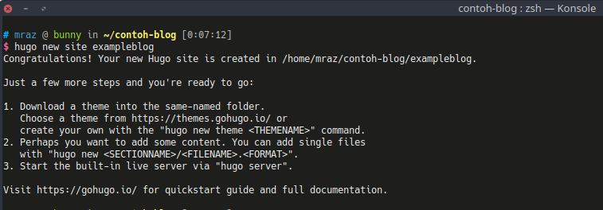
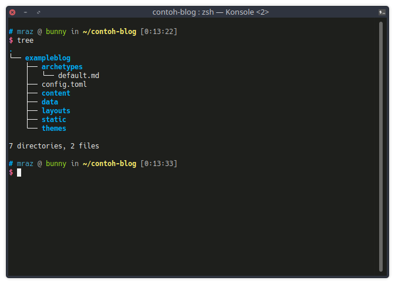
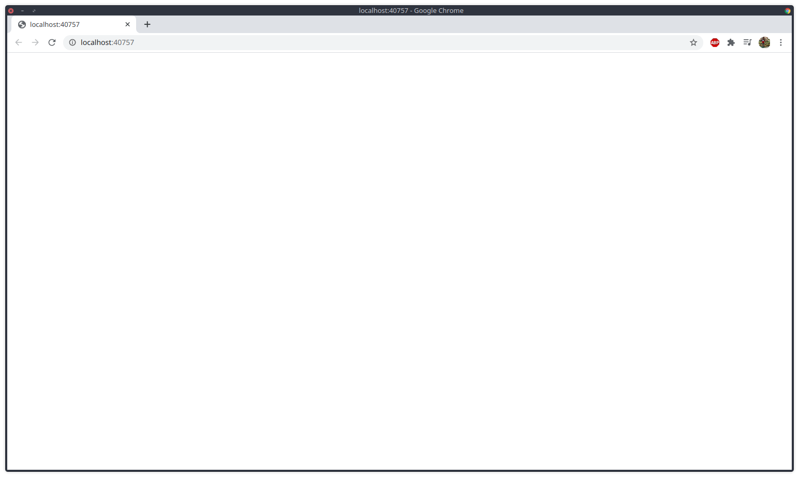

## Kenapa Hugo?
Pertanyaan ini pasti muncul ketika melihat tulisan ini, kenapa mesti Hugo? apa hebatnya? kn ada wordpress dan blogger dan lain - lain, okelah jika dibandingkan dengan CMS tersebut web statis seperti Hugo ini tidak kalah powerful, tapi saya punya beberapa kendala ketika menggunakan wordpress, antara lain : 
1. Size storage di hosting saya sangat kecil (maklum belom jadi sultan), sehingga ketika mau upload gambar mesti mikir - mikir dulu beberapa parameter seperti size dan lain - lain.
2. Kalau tidak ada Internet mau kustomisasi blog susah, ya walaupun kadang tinggal install LAMPP atau XAMPP si, tapi menurut saya hal tersebut mulai agak ribet. 
3. Hugo ini praktis, dulu pernah coba Jekyll tapi ya rada nganu, panjang kalo diceritain. Hugo ini enak, deploy cepet, gampang dipelajarin pula, walau belum bisa bahasa GO pun. 
4. Jika dikolaborasikan dengan GitHub Pages Hugo ini menyenangkan, build otomatis pake travis CI atau tools lain. pokoknya tinggal add -> commit -> push -> ngopi -> finish. 
5. Menulis konten di Hugo menggunakan MD (Markdown) yang mana format MD ini gampang banget dipelajarin, dokumentasi lengkap, dan tutorial banyak pula. 

Oke lanjut tutorial buat web dengan Hugo. 

## Membuat Web Statis dengan Hugo
Masukkan perintah berikut untuk membuat nama blog, masukkan [nama-blog] sesuai dengan nama yang Anda inginkan. 
````
hugo new site [nama-blog]
````
Disini dicontohkan dengan nama blog 'exampleblog'
````
hugo new site exampleblog
````
Maka output yang akan dikeluarkan seperti berikut : 

Setelah membuat blog dengan perintah tersebut maka beberapa direktori yang dibuat seperti gambar berikut: 

Setelah berhasil membuat website "exampleblog" jalankan perintah berikut untuk melihat apakah hugo berhasil berjalan atau tidak
````
hugo server -D
````
Pasti akan tampil halaman kosong tanpa ada apapun, yak benar hal tersebut karena tema yang belum diterapkan pada websitenya. Pantau terus blog ini karena akan bersambung ke part 2


Terima kasih.
