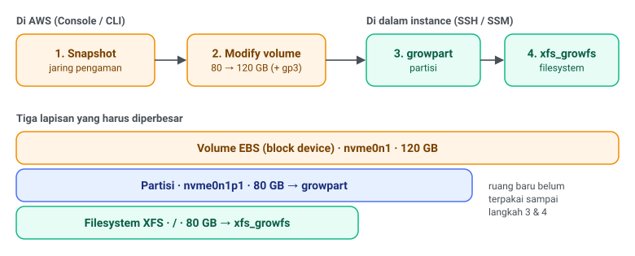

Disk root salah satu server MongoDB production saya sudah terpakai 85% (68 dari 80 GB). Sebelum mentok, saya perbesar jadi 120 GB. Kabar baiknya, di EC2 ini bisa dilakukan **online**: tanpa reboot, tanpa stop MongoDB.

Satu hal yang sering bikin bingung: setelah ukuran volume diubah di console, `df` tetap menunjukkan ukuran lama. Itu karena ada tiga lapisan yang harus diperbesar, dan AWS cuma mengurus lapisan pertama.



Contoh di tulisan ini memakai Amazon Linux 2023 dengan root filesystem XFS di `/dev/nvme0n1p1`.

## 0. Cek kondisi awal

```bash
df -hT
```

```
Filesystem       Type      Size  Used Avail Use% Mounted on
/dev/nvme0n1p1   xfs        80G   68G   13G  85% /
tmpfs            tmpfs     3.8G     0  3.8G   0% /tmp
/dev/nvme0n1p128 vfat       10M  1.4M  8.7M  14% /boot/efi
```

Dari sini kelihatan dua hal penting: tipe filesystem-nya **XFS** (menentukan perintah resize nanti), dan `/tmp` berupa tmpfs yang kosong. Yang kedua ini relevan karena `growpart` butuh sedikit ruang di `/tmp`; kalau disk root sudah mentok 100% dan `/tmp` ikut di root, `growpart` bisa gagal.

Sebelum resize, ada baiknya juga cek apa yang makan tempat. Kalau ternyata log atau journal yang menumpuk, menambah disk cuma menunda masalah:

```bash
sudo du -xh --max-depth=1 / | sort -rh | head -20
sudo du -xh --max-depth=1 /var/log | sort -rh | head
```

## 1. Snapshot dulu

Ini production, jadi jangan dilewati. Di **EC2 → Instances**, pilih instance-nya, buka tab **Storage**, klik Volume ID root device, lalu **Actions → Create snapshot**.

Lewat CLI:

```bash
aws ec2 create-snapshot --volume-id <volume-id> \
  --description "pre-resize $(date +%F)"
```

Snapshot pertama sebuah volume itu full copy ke S3, jadi bisa makan 15–40 menit dan statusnya lama di `pending`. **Kamu nggak perlu menunggu sampai `completed`.** Snapshot EBS bersifat point-in-time: begitu dibuat, kondisi datanya sudah terkunci pada momen itu. Status `pending` cuma berarti transfer ke S3 masih jalan di background, dan resize nggak mengganggu snapshot yang sedang berjalan.

Satu catatan: snapshot ini konsisten di level *crash*, bukan aplikasi. Kalau di-restore, hasilnya setara server yang mati mendadak; MongoDB akan replay journal saat start dan biasanya baik-baik saja. Kalau butuh snapshot yang benar-benar bersih untuk MongoDB standalone, jalankan `db.fsyncLock()` sebelum snapshot dan `db.fsyncUnlock()` setelahnya. Untuk jaring pengaman sebelum resize, snapshot biasa sudah cukup.

## 2. Modify volume

Di halaman volume: **Actions → Modify volume**, ubah **Size** dari 80 ke 120, lalu **Modify → Confirm**.

Lewat CLI:

```bash
aws ec2 modify-volume --volume-id <volume-id> --size 120

# pantau progresnya
aws ec2 describe-volumes-modifications --volume-id <volume-id> \
  --query 'VolumesModifications[].{state:ModificationState,progress:Progress}'
```

Tunggu sampai state jadi `optimizing` (di console: `in-use - optimizing`). Begitu masuk `optimizing`, kapasitas baru sudah bisa dipakai, nggak perlu tunggu `completed`.

### Sekalian pindah ke gp3?

Kalau volume-nya masih **gp2**, ganti **Volume type** ke **gp3** di form yang sama. Alasannya:

- **Performa.** gp2 memberi IOPS proporsional ukuran: 3 IOPS per GB. Di 80 GB itu cuma baseline 240 IOPS (120 GB pun baru 360), sisanya bergantung burst credit yang bisa habis. gp3 memberi **3000 IOPS dan 125 MB/s** tetap, berapa pun ukurannya. Untuk database yang datanya jauh lebih besar dari RAM (sering baca dari disk), ini langsung terasa di latensi query.
- **Harga.** gp3 sekitar 20% lebih murah per GB.

Pindahnya online, tanpa reboot, dan nggak menyentuh data. Yang penting, **lakukan dalam satu operasi Modify yang sama**, karena setelah modify selesai volume kena *cooldown* sekitar 6 jam sebelum bisa diubah lagi.

gp2 cuma lebih menarik untuk disk yang sangat besar (di atas ~1 TB, IOPS-nya naik otomatis), dan itu jarang berlaku untuk root disk.

## 3. Perbesar partisi

Masuk ke instance (SSH atau **Connect → Session Manager**). Bagian ini nggak ada gantinya di console.

```bash
lsblk
```

Yang dicari: disk `nvme0n1` sudah 120G, tapi partisi `nvme0n1p1` masih 80G. Kalau disk-nya masih 80G juga, berarti modify volume belum sampai `optimizing`; tunggu sebentar.

```bash
sudo growpart /dev/nvme0n1 1
```

Perhatikan **spasi** antara nama disk dan angka `1`. Outputnya kira-kira `CHANGED: partition=1 start=... old: size=... new: size=...`.

Soal partisi EFI `nvme0n1p128`: di Amazon Linux 2023 letaknya di awal disk, jadi `p1` tetap partisi terakhir dan `growpart` bisa langsung memakai ruang kosong di belakangnya. Kalau mau memastikan dulu:

```bash
sudo sgdisk -p /dev/nvme0n1
```

`p1` seharusnya punya End sector paling besar.

Kalau `growpart` bilang `NOCHANGE: partition 1 ... cannot be grown`, OS belum melihat ukuran barunya. Refresh dengan:

```bash
sudo sh -c 'echo 1 > /sys/class/block/nvme0n1/device/rescan_controller'
```

lalu ulangi `lsblk`.

## 4. Perbesar filesystem

Untuk XFS (default Amazon Linux):

```bash
sudo xfs_growfs -d /
```

XFS di-grow dalam keadaan **mounted**, dan inilah yang membuat prosesnya tanpa downtime. Kalau filesystem kamu ext4, perintahnya:

```bash
sudo resize2fs /dev/nvme0n1p1
```

## 5. Verifikasi

```bash
df -hT /
```

`/` sekarang sekitar 120G, dan Use% turun dari 85% ke sekitar 57%. MongoDB jalan terus selama proses ini.

## Ringkasan

| Langkah | Di mana | Perintah / menu |
|---|---|---|
| Snapshot | AWS | Actions → Create snapshot (nggak perlu tunggu `completed`) |
| Resize volume (+ gp3) | AWS | Actions → Modify volume, tunggu `optimizing` |
| Perbesar partisi | Instance | `sudo growpart /dev/nvme0n1 1` |
| Perbesar filesystem | Instance | `sudo xfs_growfs -d /` (XFS) atau `resize2fs` (ext4) |
| Verifikasi | Instance | `df -hT /` |

Terakhir, menambah disk itu solusi jangka pendek. Kalau pertumbuhannya dari data (bukan log), apalagi datanya sudah jauh melebihi RAM instance, pantau trennya dan pertimbangkan juga upsize instance atau strategi retensi data, supaya kamu nggak mengulang langkah ini tiap beberapa bulan.
