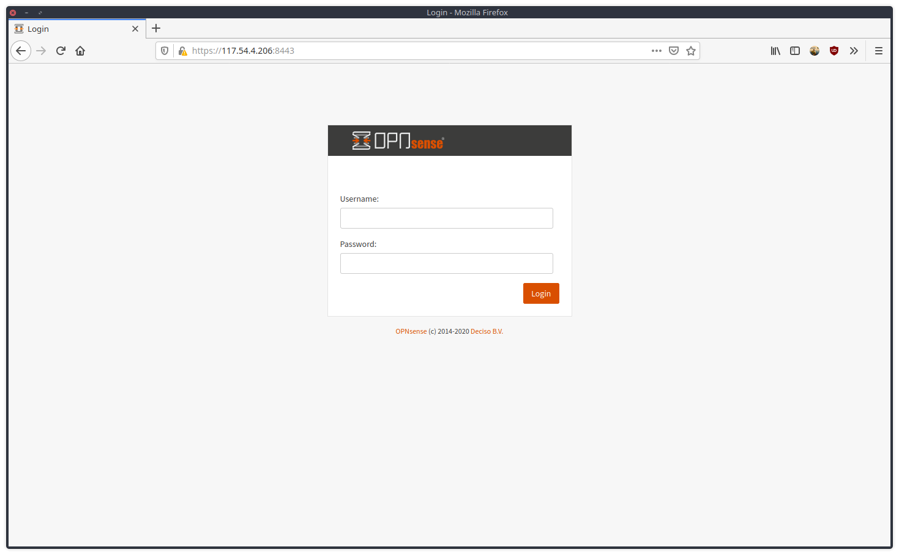

OPNsense adalah proyek firewall berbasis open source berbasis FreeBSD [OPNsense](https://opnsense.org/).



Berikut adalah tutorial untuk mengkonfigurasi HAProxy di OPNsense. 

### 1. Konfigurasi Firewall untuk HAProxy
1. Buat 2 IP Forward pada konfigurasi firewall
   - Firewall > NAT > Port Forward > + New Rule
````
Interface : LAN
TCP/IP Ver : IPv4
Protocol : TCP
Source : any
Destination port range : From - HTTP , to - HTTP 
Redirect target IP : #IPADDRESSOPNSENSE
Redirect target port : HTTP
SAVE

Interface : LAN
TCP/IP Ver : IPv4
Protocol : TCP
Source : any
Destination port range : From - HTTPS , to - HTTPS
Redirect target IP : #IPADDRESSOPNSENSE
Redirect target port : HTTP
SAVE

````
2. Buat Rule Floating
    - Firewall > Rules Floating > + New Rule
````
Action : Pass
Interface : LAN
Direction : in 
TCP/IP ver : IPv4
Protocol : TCP 
Source : any 
Destination : Lan Address
Destination port range : From - HTTP , to - HTTP 

Action : Pass
Interface : LAN
Direction : in 
TCP/IP ver : IPv4
Protocol : TCP 
Source : any 
Destination : Lan Address
Destination port range : From - HTTPS , to - HTTPS
````
### 2. Konfigurasi HAProxy
- Service > HAProxy > Setting

#### Tambahkan Server
````
Real Servers > Real Servers > + add
Name : test-http
FQDN or IP  : #IPPUBLICSERVER
Port : 80
SAVE
````
#### Tambahkan Backend Pool
````
Virtual Services > Backend Pool > + add
Name : test_http
Mode : Layer 7 
Servers : test-http
SAVE
````
#### Tambahkan Conditions
````
Rules and Check > Conditions > + add
Name: test-http
Condition type : Host Matches
Host String : test-http
````
#### Tambahkan Rules untuk frontend 443 
````
Rules and Check > Rules > + add
Name : pass_https_test_http
Select Condition : test-http
Execute function : Use specified Backend Pool
Use backend pool : test_http
````
#### Tambahkan Rules untuk frontend 80 (untuk redirect traffic ke https)
````
Rules and Check > Rules > + add 
Name : redirect_to_https_http_test_nicolas_my_id
Select Condition : test-http_nicolas_my_id
Execute function : http-request redirect
HTTP Redirect  : scheme https
````
#### Tambahkan frontend untuk port 80
````
Virtual Services > Public Services > + add
Name : FrontEndHTTP
Listent address : 0.0.0.0:80
Select Rules : redirect_to_https_http
````
#### Tambahkan frontend untuk port 443
````
Virtual Services > Public Services > + add
Name : FrontEndHTTPS
Listent address : 0.0.0.0:443
Enable SSL offloading : (✓)
Certificates : test-http # Pastikan sertifikat sudah di-import ke OPNsense
Select Rules : pass_https_test_http
````
